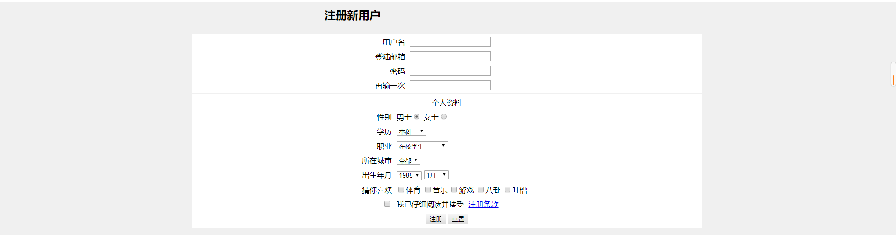

# CSS练习与作业 第二天

### 练习题目:

1.CSS结合FORM表单对样式进行调整

2.通过选择器对CSS样式进行控制

(提示:运用DIV标签)

3.制作网页导航栏下拉样式表

(提示:伪类选择器hover)

### 作业题目:

1.复习课上代码 回忆div调整CSS样式 伪类选择器下拉菜单制作

2.制作一个网页下拉导航栏,效果要求如图所示:

其中,选择[用户]下拉出现墨绿色一栏,再次选择[博客]下拉出现黄色一栏,再次选择[我的博客],出现墨绿色一栏

3.制作一个注册界面,要求效果如图所示:

要求:使用一个四行三列的表格制作此表单