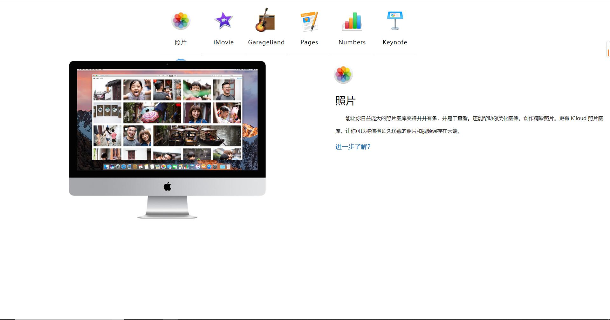
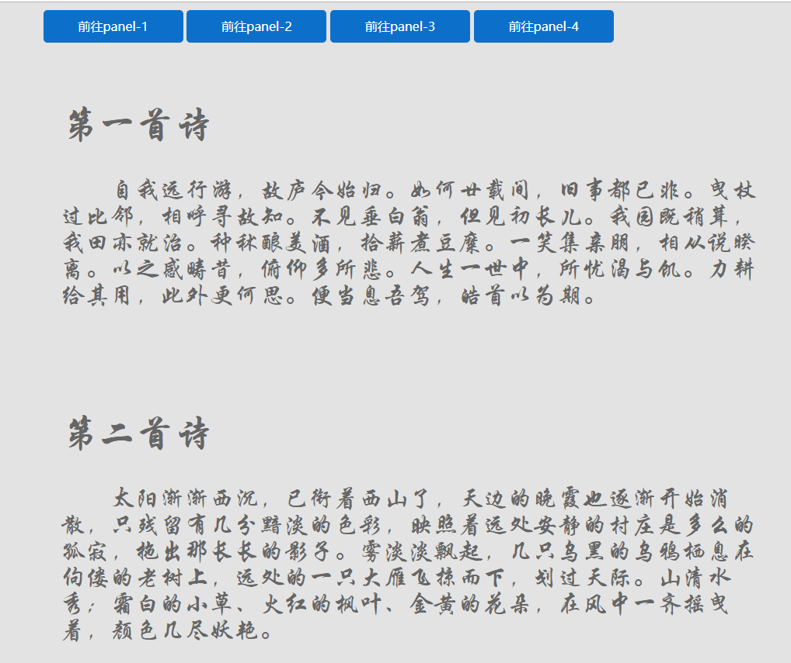
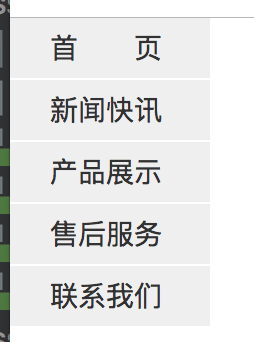

# CSS练习与作业 第四天

### 练习题目:

1.盒子模型的概念

2.五个DIV通过定位实现不同效果

(提示:绝对定位 相对定位 固定定位)

3.导航栏横向展示

(提示:浮动)

4.标签不同效果

(提示:target和active)

5.实现百度百科页面效果

(提示:a标签的超链接和锚标签/对text和font的设置)

### 作业题目:

1.复习课上代码 盒模型的边距以及浮动定位

2.制作一个网页,效果要求如图所示:

3.制作一个网页下拉导航栏,效果要求如图所示:

要求:点击导航栏时,图片效果如下图所示:

4.制作一个侧面导航栏,要求要过如图所示:

要求:

1.鼠标滑过导航栏 变色为黄色
2.导航栏放平 
3.制作下拉菜单(产品展示-产品功能/产品图片/产品介绍) 产品功能-A功能/B功能/C功能