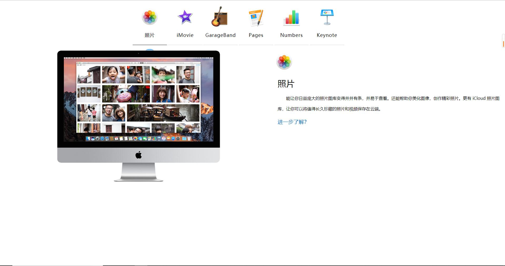
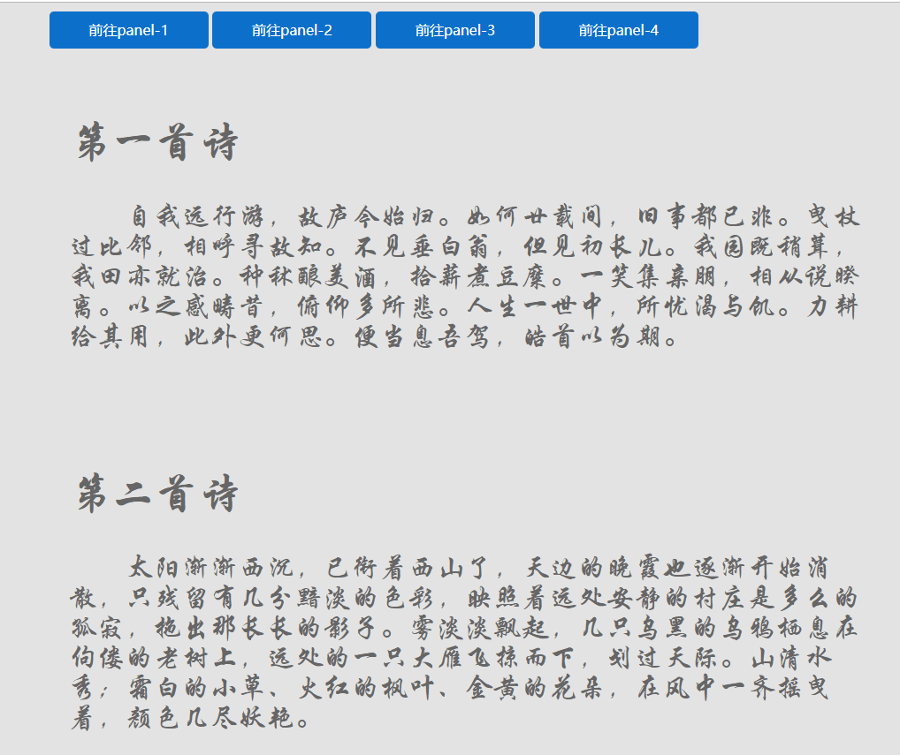
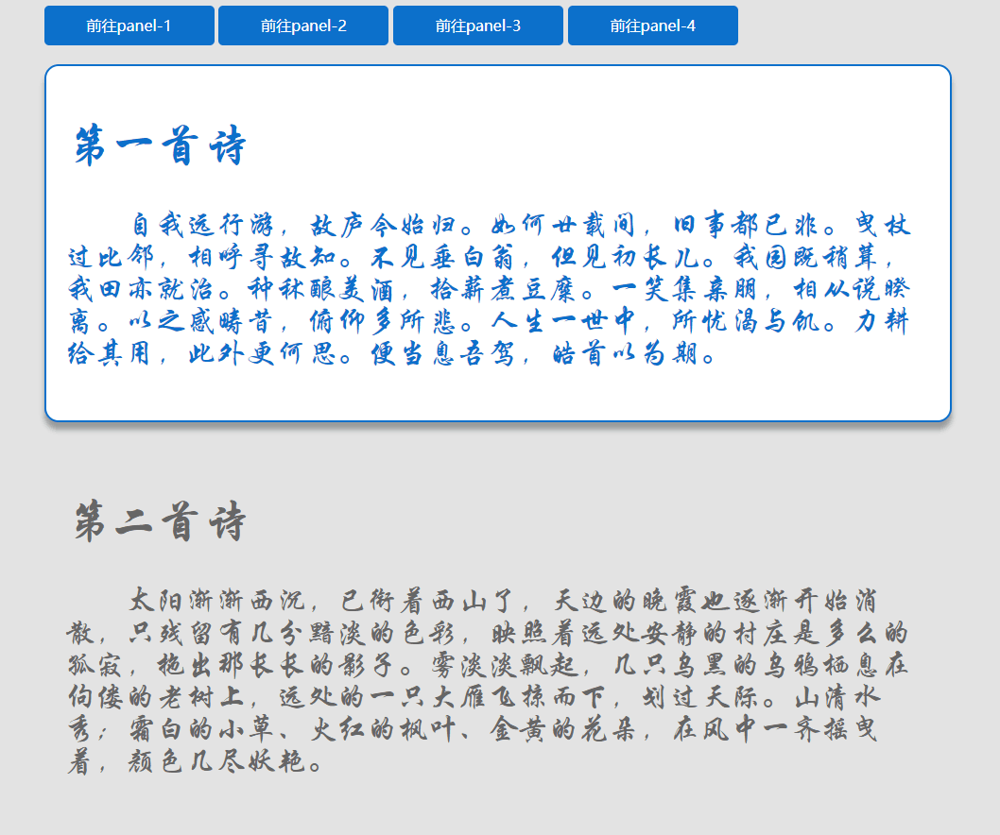
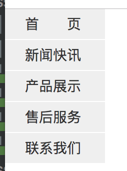

# CSS第四天作业 参考答案 

### 作业题目:

1.复习课上代码 盒模型的边距以及浮动定位

2.制作一个网页,效果要求如图所示:



3.制作一个网页下拉导航栏,效果要求如图所示:



要求:点击导航栏时,图片效果如下图所示:



4.制作一个侧面导航栏,要求要过如图所示:



要求:

1.鼠标滑过导航栏 变色为黄色
2.导航栏放平 
3.制作下拉菜单(产品展示-产品功能/产品图片/产品介绍) 产品功能-A功能/B功能/C功能


### 答案:

2.

```
<!DOCTYPE html>
<html>
	<head>
		<meta charset="UTF-8">
		<title></title>
	<style type="text/css">
		.big{
			height: 150px;
			float: left;
		}
		.dvphoto{
			width: 100px;
			height: 150px;
			border-bottom: 3px solid gray;
			margin-left: 500px;
			float: left;
		}
		.movie,.garage,.pages,.numbers,.keynote{
			float: left;
			border-bottom: 2px solid lightgray;
			width: 100px;
			height: 150px;
			margin-left: 30px;
		}
		.dvphoto1,.img{
			width: 100px;
			height: 120px;
			background: url(../../img/hw180926/nav_icon_photos_large.png);
			background-repeat: no-repeat;
			background-position:center ;
		}
		.dvphoto2,.movie2,.garage2,.pages2,.numbers2,.keynote2{
			width: 100px;
			height: 30px;
			text-align: center;
			line-height: 1px;
		}
		
		.movie1{
			width: 100px;
			height: 120px;
			background: url(../../img/hw180926/nav_icon_imovie_large_2x.png);
			background-position: center;
			background-size: contain;
		}
		.garage1{
			width: 100px;
			height: 120px;
			background: url(../../img/hw180926/nav_icon_garageband_large_2x.png);
			background-position: center;
			background-size: contain;
			background-repeat: no-repeat;
		}
		.pages1{
			width: 100px;
			height: 120px;
			background: url(../../img/hw180926/nav_icon_pages_large_2x.png);
			background-position: center;
			background-size: contain;
		}
		.numbers1{
			width: 100px;
			height: 120px;
			background: url(../../img/hw180926/nav_icon_numbers_large_2x.png);
			background-position: center;
			background-size: contain;
		}
		.keynote1{
			width: 100px;
			height: 120px;
			background: url(../../img/hw180926/nav_icon_keynote_large_2x.png);
			background-position: center;
			background-size: contain;
		}
		.dvdesk{
			width: 700px;
			height: 600px;
			background: url(../../img/hw180926/bia_photos_medium_2x.jpg);
			float: left;
			background-size: contain;
			background-repeat: no-repeat;
			margin-top: 50px;
			margin-left: 200px;
			
			
		}
		.right{
			width: 500px;
			height: 300px;
			margin-right: 200px;
			float: right;
		}
		.txt{
			clear: both;
			height: 180px;
			
		}
		.p1{
			margin-left: 30px;
			font-weight: bold;
			font-size: 20px;
		}
		.p2{
			margin-left: 30px;
			word-break: break-all;
			text-indent: 2em;
		}
		.p3 a{
			margin-left: 30px;
			font-size: 15px;
			font-weight: bold;
			text-decoration: none;
		}
		.img{
			width: 100px;
			height: 120px;
			background: url(../../img/hw180926/nav_icon_photos_large.png);
			background-repeat: no-repeat;
			background-position:center ;
			float: left;
		}
	</style>
	</head>
	
	<body>
		<div class="big">

		<div class="dvphoto">
			<div class="dvphoto1">
				
			</div>
			
			<div class="dvphoto2">
				照片
			</div>
		</div>
		
		
		<div class="movie">
			<div class="movie1">
				
			</div>
			<div class="movie2">
				iMovie
			</div>
		</div>
		
		<div class="garage">
			<div class="garage1"></div>
			<div class="garage2">garage</div>
		</div>
		
		<div class="pages">
			<div class="pages1"></div>
			<div class="pages2">pages</div>
		</div>
		<div class="numbers">
			<div class="numbers1"></div>
			<div class="numbers2">numbers</div>
		</div>
		
		<div class="keynote">
			<div class="keynote1"></div>
			<div class="keynote2">keynote</div>
		</div>
					
		</div>
		
		<div class="dvdesk">
			
		</div>
		
		<div class="right">
			<div class="img">
				
			</div>
			<div class="txt">
				<p class="p1">照片</p>
				<p class="p2">XXXXXXXXXXXXXXXXXXXXXXXXXXXXXXXXXXXXXXXXXXXXXXXXXXXXXXX</p>
				<p class="p3"><a href="">进一步了解?</a></p>
			</div>
		</div>
	</body>
</html>

```

3.

```
<!DOCTYPE html>
<html>
	<head>
		<meta charset="UTF-8">
		<title></title>
		<style type="text/css">
			body{
				background: gray;
			}
			.dv1,.dv2{
				width: 150px;
				height: 50px;
				background: #2B99FF;
				color: white;
				text-align: center;
				line-height: 50px;
				border-radius: 5px;
				float: left;
				margin: 10px;
				
			}
			a{
				text-decoration: none;
				color: white;
			}
			.dv3{
				height: 300px;
				width: 600px;
				
				clear: both;
			}
			.dv31{
				height: 100px;
				width: 200px;
				font-family: "楷体";
				font-weight: bold;
				font-size: 40px;
				color: black;
				margin-top: 20px;
				margin-left: 20px;
			}
			.dv32{
				text-indent: 2em;
				font-family: "楷体";
				font-size: 20px;
				color: black;
			}
			#no1:target{
				background: white;
				border: 1px solid blue;
				box-shadow: 3px 3px 5px white;
				border-radius: 15px;
				}
			#no1:target div{
					
				color: blue;
				}
				
			.dv4{
				height: 300px;
				width: 600px;
				
				clear: both;
			}
			.dv41{
				height: 100px;
				width: 200px;
				font-family: "楷体";
				font-weight: bold;
				font-size: 40px;
				color: black;
				margin-top: 20px;
				margin-left: 20px;
			}
			.dv42{
				text-indent: 2em;
				font-family: "楷体";
				font-size: 20px;
				color: black;
			}
			#no2:target{
				background: white;
				border: 1px solid blue;
				box-shadow: 3px 3px 5px white;
				border-radius: 15px;
				}
			#no2:target div{
					
				color: blue;
				}
		</style>
	</head>
	<body>
		<div class="dv1"><a href="#no1">前往第一首诗</a></div>
		<div class="dv2"><a href="#no2">前往第二首诗</a></div>
		
		<div class="dv3" id="no1">
			<div class="dv31">第一首诗</div>
			<div  class="dv32">自我远行游，故庐今始归。如何廿载间，旧事都已非。曳杖过比邻，相呼寻故知。不见垂白翁，但见初长儿。我园既稍葺，我田亦就治。种秫酿美酒，拾薪煮豆糜。一笑集亲朋，相从说暌离。以之感畴昔，俯仰多所悲。人生一世中，所忧渴与饥。力耕给其用，此外更何思。便当息吾驾，皓首以为期</div>
		
		</div>
		
		<div class="dv4" id="no2">
			<div class="dv41">第二首诗</div>
			<div  class="dv42">自我远行游，故庐今始归。如何廿载间，旧事都已非。曳杖过比邻，相呼寻故知。不见垂白翁，但见初长儿。我园既稍葺，我田亦就治。种秫酿美酒，拾薪煮豆糜。一笑集亲朋，相从说暌离。以之感畴昔，俯仰多所悲。人生一世中，所忧渴与饥。力耕给其用，此外更何思。便当息吾驾，皓首以为期</div>
		
		</div>
	</body>
</html>

```

4.

```
<!DOCTYPE html>
<html>
	<head>
		<meta charset="UTF-8">
		<title></title>
	</head>
	<style type="text/css">
		.dv0{
			width: 200px;
			height: 50px;
			border-radius: 10px;
			line-height: 50px;
			text-align: center;
			background: darkgray;
			margin: 10px;
			float: left;
		}
		
		.dv0:hover{
			background: yellow;
		}
		
		.dv30{
			height: 100px;
			width: 200px;
			display: none;
			clear: both;
		}
		.dv3:hover .dv30{
			display: block;
		}
		.dv4{
			height:50px;
			width: 400px;
			display: none;
			margin-left: 200px;
			margin-top: -50px;
			float: left;
			
		}
		.dv31,.dv32,.dv33{
			width: 180px;
			height: 50px;
			background: greenyellow;
			margin: 1px;
			clear: both;
		}
		.dv31:hover .dv4{
			display: block;
		}
		.dv41,.dv42,.dv43{
			width: 100px;
			height: 50px;
			background: lightgoldenrodyellow;
		float: left;
			margin: 5px;
		}
		
		.dv1:active {
			background: green;
		}
		
	</style>
	<body>
		<div class="dv0 dv1">首页</div>
		<div class="dv0">新闻快讯</div>
		<div class="dv0 dv3">产品展示
			<div class="dv30">
				<div class="dv31"> 功能
					<div class="dv4">
						<div class="dv41">A</div>
						<div class="dv42">B</div>
						<div class="dv43">C</div>
						
					</div>
				</div>	
				<div class="dv32">图片</div>
				<div class="dv33">介绍</div>
			</div>
		</div>
		<div class="dv0">售后服务</div>
		<div class="dv0">联系我们</div>
	</body>
</html>

```

