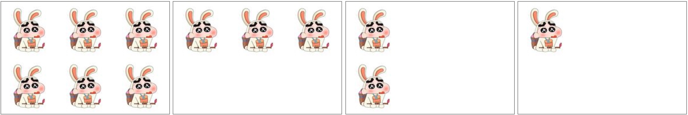
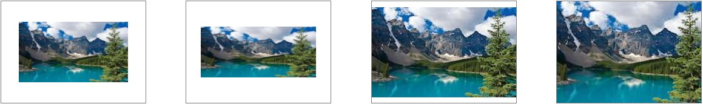

# 概述

  在当今的HTML页面中，页面的背景色默认为“白色”，除了少许的表单元素及HTML5规范后才出现的一些新的“功能性”元素标签，其它元素是不具有背景色的（也可以理解为透明的）。要为页面内的元素添加漂亮的“装饰”，让页面表现得更加丰富，区别于人，除了“border”、“outline”、“box-shadow”外，“background”在里面也扮演着相当重要的角色，本章的主要内容就是围绕“background”这个属性进行的。

# 元素背景

## 1、背景颜色

  `background-color` 属性主要用于设置元素的背景颜色，可以使用的颜色为Web技术中的常用颜色模式：“颜色英文单词”、“HEX”、“RGBa”、“HSLa”

```css
section.t1 { background-color: red; }

section.t2 { background-color: #008800; }

section.t3 { background-color: rgba(0, 0, 0, 1); }
```

> 提示：
>
> 1、十六进制颜色参照表：https://yusi123.com/1090.html
>
> 2、Webstorm 颜色拾取器：在编辑颜色的位置输入 `choose color...`

## 2、背景图片

  `background-image` 用于设置背景图片，在实际运用的过程中需要注意的是背景图片“background-image”是可以和背景色“background-color”共存的，也就是当采用一张“非矩形”的“png图片”作为背景图片时要小心背景色带来的意外影响。

```css
div { background-image: url(images/1.jpg) }
```

## 3、背景重复

  `background-repeat` 用于设置背景图片的重复方式。当一张背景图片宽或高小于其元素容器，或用 *background-size*（后面会讲到）设置宽高小于元素容器的宽高时，背景图片默认会以“平铺”的方式排满整个元素的背景，而该属性正式用于控制图像重复排列方式的，它有以下值：

- repeat：默认，以“平铺”的方式排列图片
- repeat-x：只在水平方向（X轴方向）进行重复
- repeat-y：只在垂直方向（Y轴方向）进行重复
- no-repeat：使背景图片不重复

```html
<div class="bg-repeat-wrap">
    <section class="item repeat"></section>
    <section class="item repeat-x"></section>
    <section class="item repeat-y"></section>
    <section class="item no-repeat"></section>
</div>
```

```css
.bg-repeat-wrap { text-align: center;}
.bg-repeat-wrap .item {
    width:  300px;
    height: 200px;
    border: 1px solid #808080;

    display: inline-block;

    /*设置背景图片*/
    background-image: url("../images/timor.jpeg");
}
.repeat    { background-repeat: repeat;}
.repeat-x  { background-repeat: repeat-x;}
.repeat-y  { background-repeat: repeat-y;}
.no-repeat { background-repeat: no-repeat;}
```



## 4、背景尺寸

  `background-size` 属性用于设置背景图片的大小，主要可以通过四种类型的单位设置：

- 像素值

  可以通过像素“px”精确地设置背景图片的大小。需要设置为两个值，第一个值表示背景图的宽度，第二个值表示背景图的高度，还可以通过设置宽度或高度的其中一个，将另外一个值设置成 `auto` 达到保持背景图原始图像比例的效果。如：“240px 120px”、“180px auto”或“auto（相当于还原默认的大小）”。


- 百分比值

  用“百分比”作为值，结构和用“像素值”一致，也是两个值，第一个值是相对于元素宽度的百分比值，第二个值是相对于元素高度的百分比。如：“100% 80%”、“100% auto”或“auto 50%”。


- contain

  自动将背景图像填满元素的其中一边，图像的比例保持不变。


- cover

  在保持图像原始比例的情况下，将元素的背景区域完全覆盖，超出元素宽高的部分会自动被裁剪，是一种比较“智能”的背景图片大小设置方式，通过配合“background-position”属性使用可以将开发者认为背景图像中“更重要”的部分通过定位显示出来。

```html
<div class="bg-size-wrap">
    <section class="item px"></section>
    <section class="item percent"></section>
    <section class="item contain"></section>
    <section class="item cover"></section>
</div>
```

```css
.bg-size-wrap {
    text-align: center;
}
.bg-size-wrap .item {
    width:  238px;
    height: 168px;

    display: inline-block;
    margin: 0px 30px;
    border: 1px solid #808080;
    
    background-image: url("../images/sights.jpeg");
    background-repeat: no-repeat;
    background-position: center center;
}

.bg-size-wrap .px      { background-size: 180px 100px;}
.bg-size-wrap .percent { background-size: 80% 50%;}
.bg-size-wrap .contain { background-size: contain;}
.bg-size-wrap .cover   { background-size: cover;}
```



## 5、背景定位

  `background-position` 属性用于设置背景图片在元素内出现的位置。使用这个属性主要分为两类实际情况：第一类情况就是当背景图片的尺寸小于元素尺寸时，通过 ”0“ 或 ”正数值“ 去进行定位；第二类情况就是当背景图片的尺寸大于元素尺寸时，通过 “0”或“负数值”去进行定位。（这是采用“CSS图片精灵（CSS Sprites）”技术来开发项目的时候必用的属性）。

  该属性的值有三种形式：

- 方位英文单词

  可以有“left”、“right”、“top”、“bottom”和“center”。用法如：“left top”（默认），设置背景图在元素内的“左上方”；“right bottom”，设置背景图在元素内的“右下方”；“center center”，设置背景图在元素的“中心”。

- 百分比单位

  用法如：“0% 50%”，设置背景图在元素内“水平方向”的“左方”，垂直方向的“中心”；“50% 50%”,，设置背景图在元素内的“中心”；“100% 100%”,，设置背景图在元素内的“右下方”。


- 像素单位

  背景图的“左上角”相对于元素“左上角”偏移的距离，如“10px 20px”，设置背景图“水平向右”偏移10像素，“垂直向下”偏移20像素。

  这三种形式去设置背景图片的位置是可以“混搭”的，如：“left 100%”、“50% 70px”、“top 30px”等。不过从代码规范性的角度出发，并不推荐这种“混搭”的方式。

