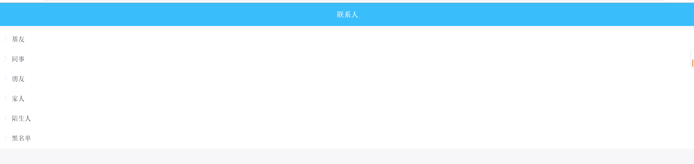
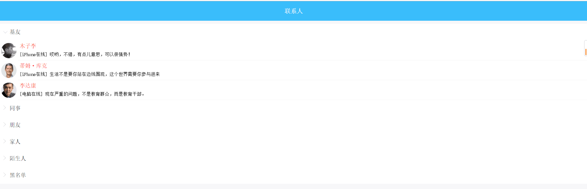
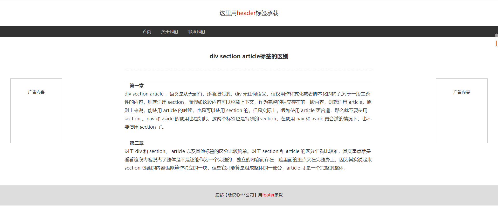

# CSS练习与作业 第四天

### 练习题目:

1.盒子模型的概念

2.五个DIV通过定位实现不同效果

(提示:绝对定位 相对定位 固定定位)

3.导航栏横向展示

(提示:浮动)

4.标签不同效果

(提示:target和active)

5.实现百度百科页面效果

(提示:a标签的超链接和锚标签/对text和font的设置)

### 

### 作业题目:

1.复习课上代码 背景设置和静态网页制作及效果实现

2.制作一个图片,效果要求如图所示:

其中,登录和注册要实现悬浮背景有透明度的效果

3.制作一个注册界面,要求效果如图所示:

其中,鼠标滑过列表时,展示列表内联系人,同事箭头旋转向下

图片地址:

[hw03.zip](../../file/css/css05/hw03.zip)

4.制作一个静态网页,要求效果如图所示:

