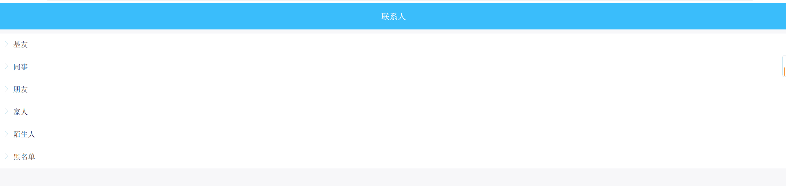
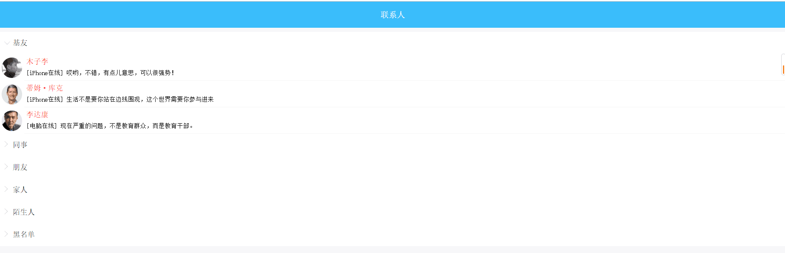
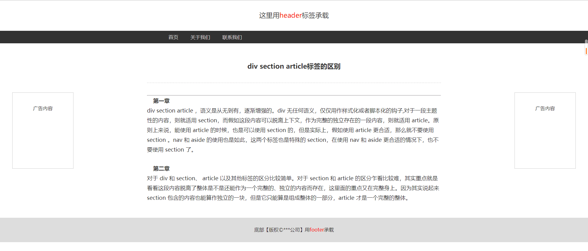

# CSS第五天作业 参考答案 

### 作业题目:

1.复习课上代码 背景设置和静态网页制作及效果实现

2.制作一个图片,效果要求如图所示:


其中,登录和注册要实现悬浮背景有透明度的效果


3.制作一个注册界面,要求效果如图所示:





其中,鼠标滑过列表时,展示列表内联系人,同事箭头旋转向下

图片地址:

[hw03.zip](../../file/css/hw03.zip)


4.制作一个静态网页,要求效果如图所示:




### 答案:

2.

```
<!DOCTYPE html>
<html>
	<head>
		<meta charset="UTF-8">
		<title></title>
		<style type="text/css">
			body{
				width: 100%;
				height: 100%;
				background: url(../../img/hw180927/bg1.jpg);
				background-repeat: no-repeat;
				background-size: cover;
			}
			.dv1{
				width: 500px;
				height: 100px;
				color: white;
				font-size: 50px;
				line-height: 100px;
				text-align: center;
				margin-top: 100px;
				margin-left: 650px;
			}
			.dv2 input{
				width: 1000px;
				height: 100px;
				border: 1px solid white;
				border-radius: 50px;
				background:transparent;
				font-size: 30px;
				text-align: center;
				line-height: 100px;
			}
			input::-webkit-input-placeholder{
            	color:white;	
        	}
        	.dv2{
        		margin-top: 50px;
        		margin-left: 400px;
        	}
        	.dv4{
        		width: 1000px;
				height: 100px;
				border: 1px solid white;
				border-radius: 50px;
				background:cornflowerblue;
				font-size: 30px;
				text-align: center;
				line-height: 100px;
				margin-top: 50px;
        		margin-left: 400px;
        	}
        	.dv6 a{
        		text-decoration: none;
        		color: white;
        	}
        	.dv6{
        		margin-top: 10px;
        		margin-left: 850px;
        		color: white;
        	}
        	.dv7{
        		margin-top: 10px;
        		margin-left: 850px;
        		color: white;
        	}
        	.dv7 a{
        		margin-left: 10px;
        	}
        	.dv4:hover {
        		opacity:0.8;
        		box-shadow: 3px 3px 5px white;
        	}
		</style>
	</head>
	<body>
		<div class="dv1">欢迎使用 请登录</div>
		
		<form action="">
			<div class="dv2">
				<input type="text" placeholder="请输入您的手机号码"/>
			</div>
			
			<div class="dv2">
				<input type="password" placeholder="请输入密码"/>
			</div>
			
			<div class="dv4">
				<button style="background: transparent;border: none;font-size: 30px;">邓丽</button>
			</div>
			
			<div class="dv4" style="background: green;">
				<button>注册</button>
			</div>
		</form>
		<div class="dv6">
			<a href="">随便看看</a> | <a href="">忘记密码?</a>
		</div>
		<div class="dv7" style="color: white;">
			其他登录方式: <a href="" style="border-radius: 70%;background: white;display: inline-block;width: 40px;height: 40px;"></a> <a href=""  style="border-radius: 70%;background: white;display: inline-block;width: 40px;height: 40px;"></a>
		</div>
	</body>
</html>

```

3.

```
<!DOCTYPE html>
<html>
	<head>
		<meta charset="UTF-8">
		<title></title>
		<style type="text/css">
			body{
				background: lightgray;
			}
			.dv0{
				height: 100px;
				width: 100%;
				background: dodgerblue;
				color: white;
				text-align: center;
				line-height: 100px;
				font-size: 40px;
				font-weight: bold;
			}
			.dvji{
				width: 100%;
				
				background: white;
				font-size: 40px;
				line-height: 60px;
				font-weight: 100;
			}
			.dvji1{
				width: 100%;
				height: 300px;
				border-bottom: 1px solid lightgray;
				background: white;
			}
			.dvji11,.dvji12,.dvji13{
				width: 100%;
				height: 100px;
				border-bottom: 1px solid lightgray;
				background: white;
			}
			.dvji11 img{
				border-radius: 70%;
				float: left;
				width: 90px;
				height: 90px;
			}
			.dvji12 img{
				border-radius: 70%;
				float: left;
				width: 90px;
				height: 90px;
			}
			.dvji13 img{
				border-radius: 70%;
				float: left;
				width: 90px;
				height: 90px;
			}
			
			.dvjitext{
				margin-top: -50px;
				width: 80%;
				height: 100px;
				float: left;
			}
			.dvjitext p{
				height: 50px;
				
			}
			.dvjip1{
				font-size: 40px;
				color: red;
			}
			.dvjip2{
				font-size: 25px;
				margin-top: -40px;
			}
			.dvji1{
				display: none;
			}
			
			.dvji:hover .dvji1{
				display: block;
			}
			.dvji:hover .santiao{
				transform: rotate(90deg);
				/*-ms-transform: rotate(90deg);  IE 9*/ 
				/*-moz-transform: rotate(90deg);  Firefox*/ 
				/*-webkit-transform: rotate(90deg);  Safari and Chrome*/ 
				/*-o-transform: rotate(90deg);  Opera*/ 
			}
			/*.dvji:hover{
				height: 380px;
			}*/
		</style>
	</head>
	<body>
		<div class="dv0">联系人</div>
		<div id="">
			
		
		<div class="dvji">基友
			<div class="dvji1">
				
				<div class="dvji11">
					
					<div class="dvjitext">
						<p class="dvjip1">木子李</p>
						<p class="dvjip2">iphone在线</p>
					</div>
				</div>
				
				<div class="dvji12">
					
					<div class="dvjitext">
						<p class="dvjip1">木子李</p>
						<p class="dvjip2">iphone在线</p>
					</div>
				</div>
				
				<div class="dvji13">
					
					<div class="dvjitext">
						<p class="dvjip1">木子李</p>
						<p class="dvjip2">iphone在线</p>
					</div>
				</div>
			</div>
		</div>
		<div class="dvji">同事
			<div class="dvji1">
				
				<div class="dvji11">
					
					<div class="dvjitext">
						<p class="dvjip1">木子李</p>
						<p class="dvjip2">iphone在线</p>
					</div>
				</div>
				
				<div class="dvji12">
					
					<div class="dvjitext">
						<p class="dvjip1">木子李</p>
						<p class="dvjip2">iphone在线</p>
					</div>
				</div>
				
				<div class="dvji13">
					
					<div class="dvjitext">
						<p class="dvjip1">木子李</p>
						<p class="dvjip2">iphone在线</p>
					</div>
				</div>
			</div>
			</div>
		</div>
		<div class="dvji">家人</div>
		<!--<div>朋友</div>
		<div>陌生人</div>
		<div>黑名单</div>-->
	</body>
</html>

```

4.

```
<!DOCTYPE html>
<html>
	<head>
		<meta charset="UTF-8">
		<title></title>
		<style type="text/css">
			header{
				width: 100%;
				height: 200px;
				background: white;
				
			}
			header>div{
				height: 120px;
				width: 100%;
			}
			header nav{
				width: 100%;
				height: 30px;
				background: black;
			}
			nav>div{
				height: 30px;
				width: 100px;
				color: white;
				float: left;
			}
			
			.main{
				width: 100%;
				height:700px;
			}
			.dv1{
				height: 700px;
				width: 30%;
				
				float: left;
			}
			.ad1{
				width: 200px;
				height: 200px;
				border: 1px solid black;
				position: fixed;
				margin: 250px 150px;
			}
			.dv2{
				height: 700px;
				width: 40%;
				
				float: left;
			}
			.dv3{
				height: 700px;
				width: 30%;
				
				float: left;
			}
			.ad2{
				width: 200px;
				height: 200px;
				border: 1px solid black;
				position: fixed;
				margin: 250px 150px;
			}
			footer{
				width: 100%;
				height: 100px;
				background: lightgray;
				line-height: 100px;
				text-align: center;
			}
			h2{
				text-align: center;
			}
		</style>
	</head>
	<body>
		<header>
			<div>
				
			</div>
			
			<nav>
				<div style="margin-left: 500px;">首页</div>
				<div>关于我们</div>
				<div>联系我们</div>
			</nav>
		</header>
		
		<div class="main">
			<div class="dv1">
				<div class="ad1">广告位招商</div>
			</div>
			
			<div class="dv2">
				<h2>标签的区别</h2>
				<hr style="border: 1px dashed;"/>
				<hr />
				<h6>第一章</h6>
					<p>
div section article ，语义是从无到有，逐渐增强的。div 无任何语义，仅仅用作样式化或者脚本化的钩子,对于一段主题性的内容，则就适用 section，而假如这段内容可以脱离上下文，作为完整的独立存在的一段内容，则就适用 article。原则上来说，能使用 article 的时候，也是可以使用 section 的，但是实际上，假如使用 article 更合适，那么就不要使用 section 。nav 和 aside 的使用也是如此，这两个标签也是特殊的 section，在使用 nav 和 aside 更合适的情况下，也不要使用 section 了。


</p>
				<h6>第二章</h6>
				<p>
对于 div 和 section、 article 以及其他标签的区分比较简单。对于 section 和 article 的区分乍看比较难，其实重点就是看看这段内容脱离了整体是不是还能作为一个完整的、独立的内容而存在，这里面的重点又在完整身上。因为其实说起来 section 包含的内容也能算作独立的一块，但是它只能算是组成整体的一部分，article 才是一个完整的整体。</p>
			</div>
			<div class="dv3">
				<div class="ad2">广告位招商</div>
			</div>
		</div>
		
		<footer>
			版权XXX公司 川备案号XXXXXX
		</footer>
	</body>
</html>

```

