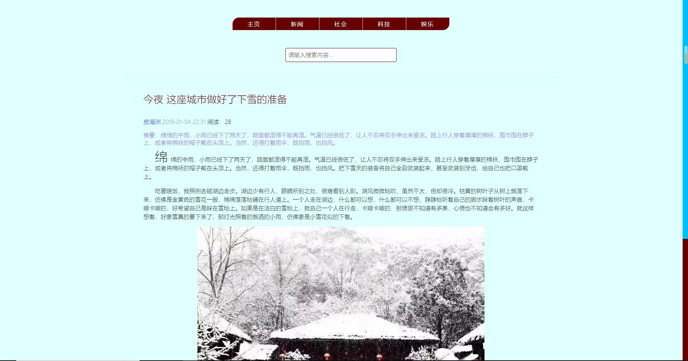
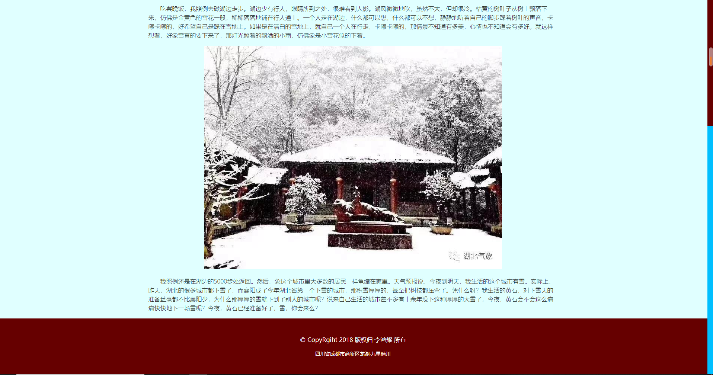

# CSS第六天作业 参考答案 

### 作业题目:

1.复习课上代码 回忆网页的布局,切图以及静态网页制作

2.制作一个网页,效果要求如图所示:




其中,搜索框选中时整体变为蓝色


### 答案:

2.

```
<!DOCTYPE html>
<html>
	<head>
		<meta charset="UTF-8">
		<title></title>
		<style type="text/css">
			header{
				height: 120px;
				background: black;
			}
			main{
				height: 800px;
				
			}
			nav{
				height: 800px;
				width: 20%;
				
				float: left;
				border-right: 1px solid gray;
			}
			nav>div{
				height: 74px;
				border-bottom: 2px solid gray;
				border-radius: 0 0 50% 0;
			}
			.content{
				height: 800px;
				width: 79%;
				float: left;
				
			}
			.leaf{
				width: 700px;
				height: 700px;
				background: #e3f9f1;
				border-radius: 70% 0 70% 0;
				box-shadow: 5px 5px 10px gray;
				transform: rotate(10deg);
				margin-top: 50px;
				margin-left: 400px;
			}
			
			.txt{
				font-size: 80px;
				transform: rotate(-40deg);
				
				padding-top: 200px;
			}
		</style>
	</head>
	<body>
		<header>
			
		</header>
		
		<main>
			<nav class="leftNav">
				<div class="nav1">CSS简述及引用</div>
				<div class="nav2">CSS简述及引用</div>
				<div class="nav3">CSS简述及引用</div>
				<div class="nav4">CSS简述及引用</div>
				<div class="nav5">CSS简述及引用</div>
				<div class="nav6">CSS简述及引用</div>
				<div class="nav7">CSS简述及引用</div>
				<div class="nav8">CSS简述及引用</div>
				<div class="nav9">CSS简述及引用</div>
				<div class="nav10">CSS简述及引用</div>
				<div class="nav11">CSS简述及引用</div>
			</nav>
			
			<div class="content">
				<div class="leaf">
					<div class="txt">
						CSS -- 网页美化大师
					</div>
				</div>
			</div>
		</main>
	</body>
</html>

```

3.

```
<!DOCTYPE html>
<html>
	<head>
		<meta charset="UTF-8">
		<title></title>
		<style type="text/css">
			body{
				background: aliceblue;
			}
			header{
				width: 100%;
				height: 250px;
				position: absolute;
				left: 0;
				top: 0;
			}
			hr{
				color: gray;
				width: 600px;
				position: relative;
				top: 120px;
			}
			nav{
				width: 505px;
				height: 50px;
				left: 650px;
				top: 50px;
				position: relative;
			}
			nav>div{
				width: 100px;
				height: 50px;
				float: left;
				background: darkred;
				margin-left: 1px;
				color: white;
				text-align: center;
				line-height: 50px;
			}
			.dvindex{
				border-radius: 50% 0 0 0;
			}
			.dvindex1{
				width: 100px;
				height: 50px;
				display: none;
				background: #2B99FF;
				color: white;
				line-height: 50px;
				text-align: center;
			}
			.dvindex:hover .dvindex1{
				top: 10px;
				position: relative;
				display: block;
			}
			.dvindex:hover{
				width: 100px;
				height: 50px;
				border-radius: 50% 0 0 0;
				text-decoration: underline;
				background: #2B99FF;
				outline: none;
			}
			.dvfun{
				border-radius: 0 0 50% 0;
			}
			.ipt{
				width: 300px;
				height: 50px;

				position: relative;
				left: 750px;
				top: 100px;
			}
			.ipt input{
				width: 300px;
				height: 50px;
				border: 1px solid black;
				border-radius: 15px;
				
			}
			input:focus{
				outline: none;
				border-color: red;
			}
			
			input:focus::-webkit-input-placeholder { 
    			color: red;
    			
    			/*outline: none;*/
				}	
			
			


			main{
				width: 100%;
				height: 1000px;
				
				position: absolute;
				top: 250px;
			}
			main>.left{
				width: 20%;
				height: 1000px;
				float: left;
				
			}
			main>.middle{
				width: 60%;
				height: 1000px;
				float: left;
				
			}
			.dvtit{
				height: 50px;
				font-size: 40px;
				color: darkred;
				margin-bottom: 20px;
				margin-top: 20px;
			}
			
			.dvau{
				height: 20px;
			}
			.sp1{
				color: blue;
			}
			.sp1:hover{
				text-decoration: underline;
			}
			.sp2{
				color: darkgray;
			}
			.dvwri{
				margin-top: 20px;
				color: purple;
			}
			
			.dvp1{
				margin-top: 20px;
				text-indent: 2em;
			}
			.dvp1:first-letter{
				font-size: 50px;
			}
			.dvp2{
				margin-top: 20px;
				text-indent: 2em;
			}
			.dvimg{
				margin-top: 20px;
				width: 600px;
				height: 300px;
				background: url(../../img/hw180928/hw01_2.jpg);
				margin-left: 400px;
				background-size: contain;
				background-repeat:no-repeat ;
			}
			.dvp3{
				margin-top: 20px;
				text-indent: 2em;
			}
			main>.right{
				width: 20%;
				height: 1000px;
				float: left;
				
			}
			footer{
				width: 100%;
				height: 250px;
				background: darkred;
				color: white;
				line-height: 250px;
				text-align: center;
				position: absolute;
				top: 1250px;
			}
			footer>div{
				width: 100%;
				height: 50px;
			}
		</style>
	</head>
	<body>
		<header>
			<nav>
				<div class="dvindex">主页
					<div class="dvindex1">
						点击进入主页
					</div>
				</div>
				<div class="dvnews">新闻</div>
				<div class="dvsh">社会</div>
				<div class="dvtec">科技</div>
				<div class="dvfun">娱乐</div>
			</nav>
			<div class="ipt">
				<input type="text" placeholder="请输入搜索内容"/>
			</div>
			<hr />
		</header>

		<main>
			<div class="left">
				
			</div>
			<div class="middle">
				<div class="dvtit">今夜 这座城市做好了下雪的准备</div>
				<div class="dvau"><span class="sp1">李杰威</span><span class="sp2">2018-01-04 22:31</span><span class="sp3">阅读：28</span> </div>
				<div class="dvwri">摘要：绵绵的中雨、小雨已经下了两天了，路面都湿得不能再湿。气温已经很低了，让人不忍将双手伸出来受冻。路上行人穿着厚厚的棉袄，围巾围在脖子上，或者将棉袄的帽子戴在头顶上。当然，还得打着雨伞，既挡雨，也挡风。</div>
				<div class="dvp1">绵绵的中雨、小雨已经下了两天了，路面都湿得不能再湿。气温已经很低了，让人不忍将双手伸出来受冻。路上行人穿着厚厚的棉袄，围巾围在脖子上，或者将棉袄的帽子戴在头顶上。当然，还得打着雨伞，既挡雨，也挡风。把下雪天的装备将自己全副武装起来，甚至武装到牙齿，给自己也把口罩戴上。</div>
				<div class="dvp2">吃罢晚饭，我照例去磁湖边走步。湖边少有行人，眼睛所到之处，很难看到人影。湖风微微地吹，虽然不大，但却很冷。枯黄的树叶子从树上飘落下来，仿佛是金黄色的雪花一般，稀稀落落地铺在行人道上。一个人走在湖边，什么都可以想，什么都可以不想，静静地听着自己的脚步踩着树叶的声音，卡嚓卡嚓的，好希望自己是踩在雪地上。如果是在洁白的雪地上，就自己一个人在行走，卡嚓卡嚓的，那情景不知道有多美，心情也不知道会有多好。就这样想着，好象雪真的要下来了，那灯光照着的飘洒的小雨，仿佛象是小雪花似的下着。</div>
				<div class="dvimg"></div>
				<div class="dvp3">我照例还是在湖边的5000步处返回。然后，象这个城市里大多数的居民一样龟缩在家里。天气预报说，今夜到明天，我生活的这个城市有雪。实际上，昨天，湖北的很多城市都下雪了，而襄阳成了今年湖北省第一个下雪的城市，那积雪厚厚的，甚至把树枝都压弯了。凭什么呀？我生活的黄石，对下雪天的准备丝毫都不比襄阳少，为什么那厚厚的雪就下到了别人的城市呢？说来自己生活的城市差不多有十余年没下这种厚厚的大雪了，今夜，黄石会不会这么痛痛快快地下一场雪呢？今夜，黄石已经准备好了，雪，你会来么？</div>
			</div>
			<div class="right">
				
			</div>
		</main>
		
		<footer>
			<div class="dv1">@2018 版权归 李杰威 所有</div>
			<div class="dv2">四川省成都市武侯区巴拉巴拉巴拉吧</div>
		</footer>
	</body>
</html>

```


