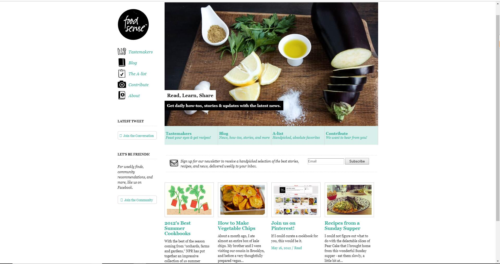
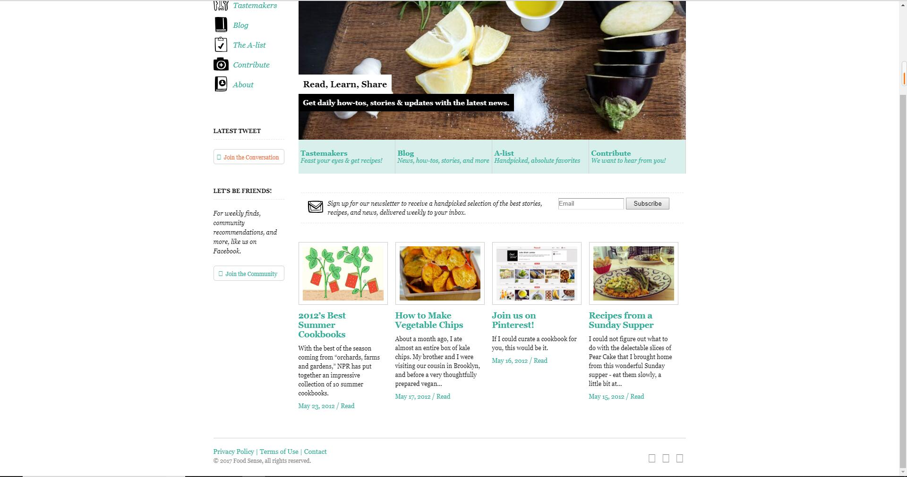
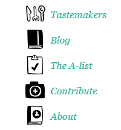
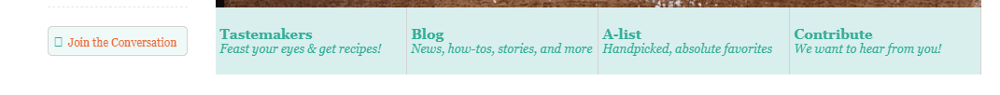
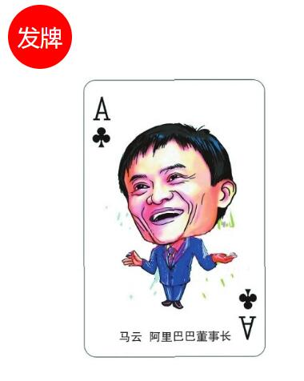
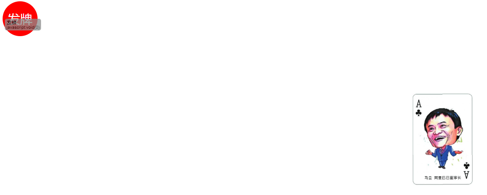

# CSS练习与作业 第七天

### 练习题目:

1.静态网页制作以及各种效果的实现

2.过渡特效

(提示:四个值分别对应 过渡的元素/过渡完成时间/速度/延时)

3.变形特效

(提示:四种变形方法 注意单位)

4.视频网站的制作

### 作业题目:

1.复习课上代码 回忆过渡特效和变形特效的设置

2.制作一个网页,效果要求如图所示:

其中,此处鼠标悬浮图片右平移,文字使用a标签

此处字体鼠标悬浮透明度变化

此处字体悬浮变色

此处字体悬浮变色

图片下载地址:

[hw01.zip](../../file/css/css07/hw01.zip)

3.制作一个变形,效果要求如图所示:

最初效果如图一所示 ,点击发牌不动,扑克牌旋转至图二位置