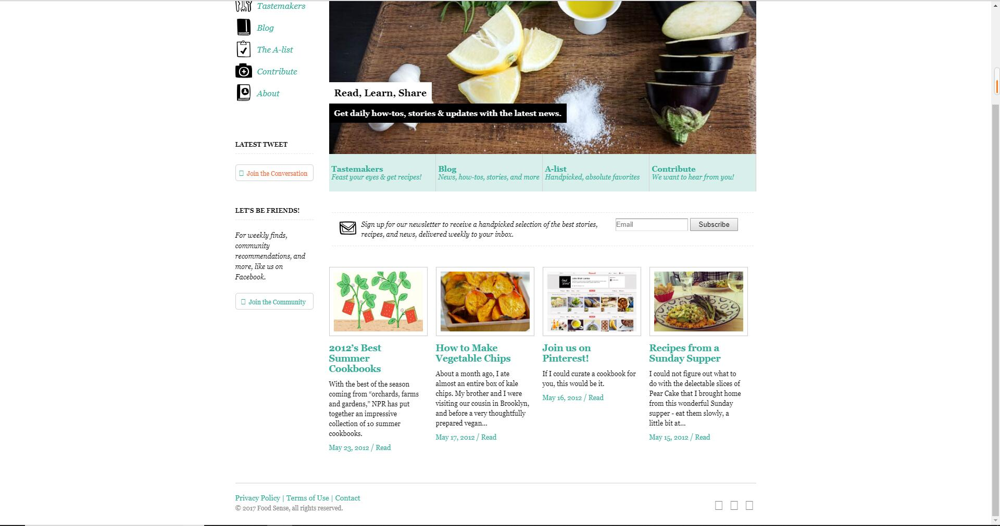
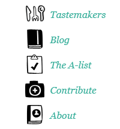
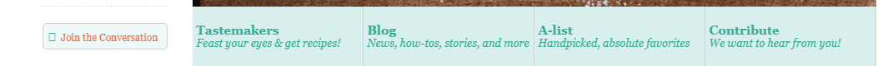
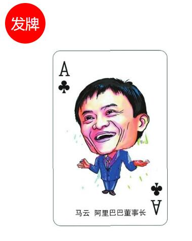
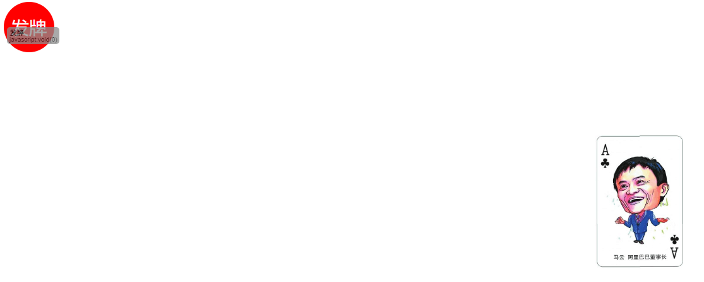

# CSS第七天作业 参考答案 

### 作业题目:

1.复习课上代码 回忆过渡特效和变形特效的设置

2.制作一个网页,效果要求如图所示:




其中,此处鼠标悬浮图片右平移,文字使用a标签

此处字体鼠标悬浮透明度变化


此处字体悬浮变色



此处字体悬浮变色


图片下载地址:

[hw01.zip](../../file/css/css07/hw01.zip)

3.制作一个变形,效果要求如图所示:





最初效果如图一所示 ,点击发牌不动,扑克牌旋转至图二位置


### 答案:

2.

```
略
```

3.

```
略
```


