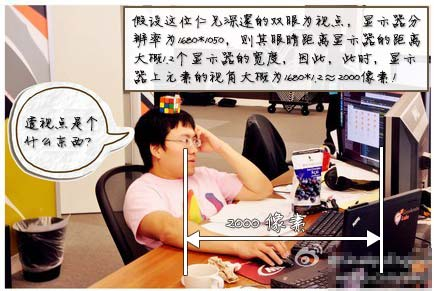

# 变形特效02

# transform-3D

  三维坐标系：

  

## 1、transform-style

  该属性规定如何在3D空间中呈现被嵌套的元素（是子元素，而不是元素本身），它主要有两个值：

- flat：（默认）表示所有子元素在2D平面呈现。
- preserve-3d：表示所有子元素在3D空间中呈现。

  当“transform-style”的值为“preserve-3D”时更贴近我们现实中的思维，因为平时我们眼睛所看到的东西都是“3D（立体）”的，而当值为“flat”的时候，就相当于在纸上画画，无论画功再好，画出的东西都是平面的，只是由于透视和明暗关系，有的时候看起来[“很立体”](http://www.gexing.com/shaitu/724322.html)罢了。

```html
<div class="wrap">
    <section class="t1">
        <span>Flat</span>
    </section>
    <section class="t2">
        <span>Preserve-3d</span>
    </section>
</div>
```

```css
.wrap {
    text-align: center;
}
.wrap section {
    width:  160px;
    height: 160px;
    background-color: #000;
    margin: 30px;

    display: inline-block;
}

.wrap section > span {
    width:  inherit;
    height: inherit;

    cursor: pointer;

    background-color: orange;
    opacity: .75;

    color: #fff;
    font-size: 20px;
    letter-spacing: 2px;

    display: flex;
    justify-content: center;
    align-items: center;

    -webkit-transition: all .75s  linear;
    -moz-transition: all .75s linear;
    -ms-transition: all .75s linear;
    -o-transition: all .75s linear;
    transition: all .75s linear;

}

.wrap > section.t1 {
    /*2d场景*/
    transform-style: flat;
}

.wrap > section.t2 {
    /*3d场景*/
    transform-style: preserve-3d;
}

.wrap section > span:hover {
    -webkit-transform: rotateX(35deg) rotateY(45deg);
    -moz-transform: rotateX(35deg) rotateY(45deg);
    -ms-transform: rotateX(35deg) rotateY(45deg);
    -o-transform: rotateX(35deg) rotateY(45deg);
    transform: rotateX(35deg) rotateY(45deg);
}
```


## 2、perspective

  “perspective” 意为透视、视角，该属性定义3D元素距视图的距离（个人理解为景深），它只对转换为了3D模式的元素生效，单位为像素。

  学美术或者学建筑的同学肯定接触过透视的一些东西：


  不过，CSS3 3D transform中的透视的透视点与上面两张示例图是不同的：CSS3 3D transform的透视点是在浏览器的前方。或者这么理解吧：显示器中3D效果元素的透视点在显示器的上方（不是后面），近似就是我们眼睛所在方位。

  比方说，一个1680像素宽的显示器中有张美女图片，应用了3D transform，同时，该元素或该元素父辈元素设置的“perspective”大小为2000像素。则这张美女呈现的3D效果就跟你本人在1.2个显示器宽度的地方(1680*1.2≈2000)看到的真实效果一致。



  “perspective”属性有两种使用方式，一种是直接作为一个属性去使用，即“perspective:400”的形式；还有一种形式是作为“Transform”属性的值去使用，这个时候就需要加上单位了，即：“transform: perspective(400px)”。为了浏览器兼容，我们需加上浏览器前缀。

```css
.stage {
    perspective: 600px;
}

.stage .box {
    transform: perspective(600px) rotateY(45deg);
}
```

  我们可以通过 “translateZ” 寻找透视位置，如果说 `rotateX` / `rotateY` / `rotateZ`可以帮助理解三维坐标，则 `translateZ`则可以帮你理解透视位置。

  我们都知道近大远小的道理，对于没有 `rotateX` 以及 `rotateY` 的元素，`translateZ` 的功能就是让元素在自己的眼前或近或远。比方说，我们设置元素 `perspective` 为201像素，如下：

```css
perspective: 201px;
```

  则其子元素，设置的 `translateZ`值越小，则子元素大小越小（因为元素远去，我们眼睛看到的就会变小）；`translateZ`值越大，该元素也会越来越大，当`translateZ`值非常接近201像素，但是不超过201像素的时候（如200像素），该元素的大小就会撑满整个屏幕（如果父辈元素没有类似 `overflow:hidden` 的限制的话）。因为这个时候，子元素正好移到了你的眼睛前面，所谓“一叶蔽目，不见泰山”，就是这么回事。当 `translateZ` 值再变大，超过201像素的时候，该元素看不见了——这很好理解：我们是看不见眼睛后面的东西的！

  再生动的文字描述也不如一个实例来得直观，我们可以直接看示例：


  代码示例（你可以忽略代码）：

```html
<form action="">
    <label>0</label>
    <input type="range" min="0" max="202" value="0" id="oRange">
    <label>202</label>
</form>
<div class="stage">
    <section class="box" id="box">translateZ：0</section>
</div>
```

```css
form {
    text-align: center;
}
.stage {
    transform-style: preserve-3d;
    perspective: 201px;

    position: absolute;
    top:  50%;
    left: 50%;
    transform: translateX(-50%) translateY(-50%);
}

.stage .box {
    width:  120px;
    height: 50px;
    background-color: red;

    display: flex;
    justify-content: center;
    align-items: center;

}
```

```javascript
var oRange    = document.getElementById('oRange');
var oBox      = document.getElementById('box');
var oShowArea = document.getElementById('show-area');
oRange.oninput = function () {
    oBox.textContent = 'translateZ：' + this.value;
    oBox.style.cssText = 'transform: translateZ(' + this.value + 'px);';
}
```

## 3、perspective-origin

  “perspective-origin” 这个属性超级好理解，表示你那双色迷迷的眼睛看的位置。默认就是所看舞台或元素的中心。有时候，我们对中心的位置是不感兴趣的，希望视线放在其他一些地方。比方说：


  一图胜千言，屌丝男们这个应该都懂的。下面为立方体的实际应用透视效果图：

```css
perspective-origin: 20% 30%;
```


## 4、backface-visibility

  该属性定义当3D元素不面向屏幕时是否可见，该属性有两个值：

- visible（默认）

  表示当3D元素通过“rotate”属性旋转到元素“背部”时，元素仍然可见。

- hidden

  表示当3D元素通过“rotate”属性旋转到元素“背部”时，元素不可见。

  在现实世界中，我们无法穿过软妹A看到其身后的软妹B或C或D；但是，在CSS3的3D世界中，默认情况下，我们是可以看到背后的元素。因此，为了切合实际，我们常常会这样设置，使后面元素不可见：

```css
backface-visibility:hidden;
```


## 5、Transform-3d effect

### 1）、Cubic Box

```html
<div class="cubic-box">
    <section class="face front">FRONT</section>
    <section class="face back">BACK</section>
    <section class="face left">LEFT</section>
    <section class="face right">RIGHT</section>
    <section class="face top">TOP</section>
    <section class="face bottom">BOTTOM</section>
</div>
```

```css
.cubic-box {
    width:  160px;
    height: 160px;

    transform-style: preserve-3d;
    transform: rotateX(30deg) rotateY(30deg);

    position: absolute;
    top: 0; right: 0; bottom: 0; left: 0;
    margin: auto;
}
.cubic-box .face {
    width:  inherit;
    height: inherit;

    /*设置背面不可见*/
    backface-visibility: hidden;

    opacity: .75;

    /*设置文本样式*/
    color: #fff;
    font-size: 30px;
    letter-spacing: 2px;

    display: flex;
    justify-content: center;
    align-items: center;

    /*绝对定位，让所有的子元素全部重叠在一起*/
    position: absolute;
}

/*设置每一个面的背景颜色*/
.front  { background-color: red;   }
.back   { background-color: green; }
.left   { background-color: blue;  }
.right  { background-color: orange;}
.top    { background-color: purple;}
.bottom { background-color: black; }

/*布局每一个面*/
.front { transform: translateZ(80px);}
.back  { transform: rotateY(180deg) translateZ(80px);}
.left  { transform: rotateY(90deg) translateZ(80px);}
.right { transform: rotateY(-90deg) translateZ(80px);}
.top   { transform: rotateX(90deg) translateZ(80px);}
.bottom{ transform: rotateX(-90deg) translateZ(80px);}
```


  我们来看一下演变过程，为了演示效果，我将设置 `backface-visibility: visible;`。


  演变过程源码：

```html
<div class="btn"></div>
<div class="cubic-box">
    <section class="face front">FRONT</section>
    <section class="face back">BACK</section>
    <section class="face left">LEFT</section>
    <section class="face right">RIGHT</section>
    <section class="face top">TOP</section>
    <section class="face bottom">BOTTOM</section>
</div>
```

```css
.btn {
    width:  70px;
    height: 70px;
    border-radius: 50%;
    background-color: #000;

    text-align: center;
    line-height: 70px;

    cursor: pointer;

    margin: 110px auto;

    color: #fff;
    font-size: 16px;
    letter-spacing: 2px;
}

.cubic-box {
    width:  160px;
    height: 160px;

    transform-style: preserve-3d;
    transform: rotateX(30deg) rotateY(30deg);

    position: absolute;
    top: 0; right: 0; bottom: 0; left: 0;
    margin: auto;
}
.cubic-box .face {
    width:  inherit;
    height: inherit;

    /*设置背面不可见*/
    /*backface-visibility: hidden;*/

    opacity: .75;

    /*设置文本样式*/
    color: #fff;
    font-size: 30px;
    letter-spacing: 2px;

    display: flex;
    justify-content: center;
    align-items: center;

    /*绝对定位，让所有的子元素全部重叠在一起*/
    position: absolute;
}

/*设置每一个面的背景颜色*/
.front  { background-color: red;   transition: all 1s linear;}
.back   { background-color: green; transition: all 1s linear 1s;}
.left   { background-color: blue;  transition: all 1s linear 2s;}
.right  { background-color: orange;transition: all 1s linear 3s;}
.top    { background-color: purple;transition: all 1s linear 4s;}
.bottom { background-color: black; transition: all 1s linear 5s;}

/*布局每一个面*/
.btn:active + .cubic-box .front { transform: translateZ(80px);}
.btn:active + .cubic-box .back  { transform: rotateY(180deg) translateZ(80px);}
.btn:active + .cubic-box .left  { transform: rotateY(90deg) translateZ(80px);}
.btn:active + .cubic-box .right { transform: rotateY(-90deg) translateZ(80px);}
.btn:active + .cubic-box .top   { transform: rotateX(90deg) translateZ(80px);}
.btn:active + .cubic-box .bottom{ transform: rotateX(-90deg) translateZ(80px);}

/*动效设计*/
@keyframes shine {
    0%  { box-shadow: 0px 0px 5px  1px skyblue;}
    50% { box-shadow: 0px 0px 10px 7px lightgrey;}
    100%{ box-shadow: 0px 0px 5px  1px skyblue;}
}
.btn { transition: all 1s linear; }
.btn:active {
    transform: scale(.75, .75);
    animation: shine .5s linear infinite alternate;
}
```

### 3）、Carousel


[源码下载](https://github.com/LiHongyao/Transform3D-Carousel)


