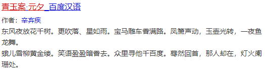
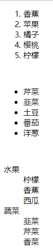
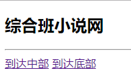
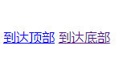
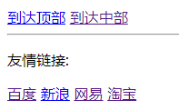

# HTML练习与作业 第一天 

### 练习题目:

1.将古诗'静夜思'在网页中展示

2.将诗歌'假如生活欺骗了你'在网页中展示

3.将古诗'从军行'在网页中展示

(提示:运用h标签,span标签,p标签分别实现)

4.制作有序列表,无序列表,自定义列表

(提示:ol有序,ul无序都要使用li标签;dl自定义列表用dt和dd标签)

5.友情链接

(提示:注意外网网址http和https的区别)

6.网页锚点定位

(提示:注意#的使用和标签ID的定义)

### 作业题目:

1.复习课上代码 回忆标签的使用

2.将古诗'青玉案元夕'展示在网页中,尽量使用三种方法,要求效果如下

3.制作有关于水果的列表,要求效果如下

4.制作一个网页,要求效果如下:

网页分为三部分:

1.顶部要求有标题 横线分割 到达中部 到达底部

2.中部要求有 到达顶部 到达底部

3.底部要求有到达顶部 到达中部 横线分割 友情链接 

