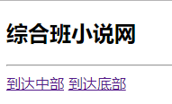
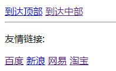

# HTML第一天作业 参考答案 

### 作业题目:

1.复习课上代码 回忆标签的使用

2.将古诗'青玉案元夕'展示在网页中,尽量使用三种方法,要求效果如下

3.制作有关于水果的列表,要求效果如下

4.制作一个网页,要求效果如下:

网页分为三部分:

1.顶部要求有标题 横线分割 到达中部 到达底部

2.中部要求有 到达顶部 到达底部

3.底部要求有到达顶部 到达中部 横线分割 友情链接 

### 答案:

2.

	<!DOCTYPE html>
	<html>
	<head>
		<meta charset="UTF-8">
		<title>青玉案元夕</title>
	</head>
	<body>
		<h3>青玉案元夕</h3>
		<h6>作者:辛弃疾</h6>
		
东风夜放花千树。更吹落、星如雨。宝马雕车香满路。凤箫声动，玉壶光转，一夜鱼

		
龙舞。

		
蛾儿雪柳黄金缕。笑语盈盈暗香去。众里寻他千百度。蓦然回首，那人却在，灯火阑

		
珊处。

		 
		 
		 
		 
		 
		<h3>青玉案元夕</h3>
		<h6>作者:辛弃疾</h6>
		东风夜放花千树。更吹落、星如雨。宝马雕车香满路。凤箫声动，玉壶光转，一夜鱼 
		龙舞。 
		蛾儿雪柳黄金缕。笑语盈盈暗香去。众里寻他千百度。蓦然回首，那人却在，灯火阑 
		珊处。
		 
		 
		 
		 
		 
		<h3>青玉案元夕</h3>
		<h6>作者:辛弃疾</h6>
		东风夜放花千树。更吹落、星如雨。宝马雕车香满路。凤箫声动，玉壶光转，一夜鱼 龙舞。 
		蛾儿雪柳黄金缕。笑语盈盈暗香去。众里寻他千百度。蓦然回首，那人却在，灯火阑 珊处。
	</body>
	</html>
3.

	<!DOCTYPE html>
	<html>
	<head>
		<meta charset="UTF-8">
		<title></title>
	</head>
	<body>
		<ol>
			<li>香蕉</li>
			<li>苹果</li>
			<li>橘子</li>
			<li>樱桃</li>
			<li>柠檬</li>
		</ol>
		 
		<ul>
			<li>芹菜</li>
			<li>韭菜</li>
			<li>土豆</li>
			<li>番茄</li>
			<li>洋葱</li>
		</ul>
		 
		<dl>
			<dt>水果</dt>
			<dd>柠檬</dd>
			<dd>香蕉</dd>
			<dd>西瓜</dd>
			
			<dt>蔬菜</dt>
			<dd>韭菜</dd>
			<dd>芹菜</dd>
			<dd>香菜</dd>
			
		</dl>
	</body>
	</html>
4.

	<!DOCTYPE html>
	<html lang="zh">
	<head>
	<meta charset="UTF-8" />
	<meta name="viewport" content="width=device-width, initial-scale=1.0" />
	<meta http-equiv="X-UA-Compatible" content="ie=edge" />
	<title>综合小说网</title>
	</head>
	<body>
	<h2>综合小说网</h2>
	

	<a href="#MIDDLE" >跳转中部</a>
	<a href="#UNDER">跳转底部</a>
	 
	 
	 
	 
	 
	 
	 
	 
	 
	 
	 
	 
	 
	 
	 
	 
	 
	 
	 
	 
	 
	 
	 
	 
	 
	 
	 
	 
	 
	 
	 
	 
	 
	 
	 
	 
	 
	 
	 
	 
	 
	 
	 
	 
	 
	 
	 
	 
	 
	 
	<a href="#TOP" id="MIDDLE">跳转顶部</a>
	<a href="#UNDER">跳转底部</a>
	 
	 
	 
	 
	 
	 
	 
	 
	 
	 
	 
	 
	 
	 
	 
	 
	 
	 
	 
	 
	 
	 
	 
	 
	 
	 
	 
	 
	 
	 
	 
	 
	 
	 
	 
	 
	 
	 
	 
	 
	 
	 
	 
	 
	 
	 
	 
	 
	 
	 
	<a href="#TOP">跳转顶部</a>
	<a href="#MIDDLE" id="UNDER">跳转中部</a>
	

	
友情链接:

	<a href="https://www.baidu.com">百度</a>
	<a href="https://www.qq.com">腾讯</a>
	<a href="https://www.sina.com">新浪</a>
	<a href="https://www.163.com">网易</a>
	 
	 
	 
	 
	 
	 
	 
	 
	 
	 
	</body>
	</html>
