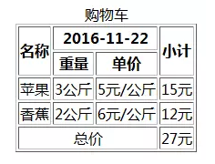
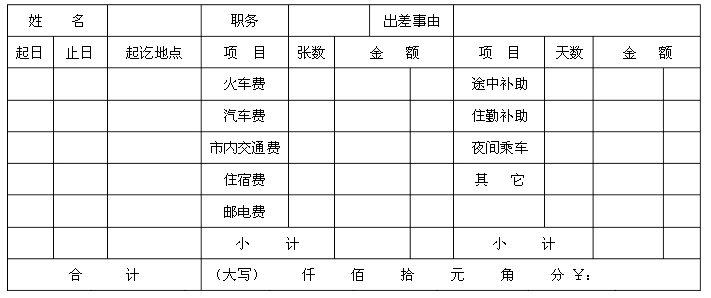

# HTML第一天作业 参考答案 

### 作业题目:

1.复习课上代码 回忆标签的使用

2.制作表格'购物车',要求效果如下

3.制作表格'出差报销申请表',要求效果如下

### 答案:

2.

	<!DOCTYPE html>
	<html>
	<head>
	    <meta http-equiv="Content-Type" content="text/html;charset=utf-8">
	</head>
	<body>
	    <table border="1">
	        <caption>购物车</caption>
	        <tr>
	            <th rowspan="2">名称</th>
	            <th colspan="2">2016-11-22</th>
	            <th rowspan="2">小计</th>
	        </tr>
	
	        <tr>
	            <th>重量</th>
	            <th>单价</th>
	        </tr>
	
	        <tr>
	            <td>苹果</td>
	            <td>3公斤</td>
	            <td>5元/公斤</td>
	            <td>15元</td>
	        </tr>
	
	        <tr>
	            <td>香蕉</td>
	            <td>2公斤</td>
	            <td>6元/公斤</td>
	            <td>12元</td>
	        </tr>
	
	        <tr>
	            <td colspan="3" align="center">总价</td>
	            <td>27元</td>
	        </tr>
	    </table>
	</body>
	</html>
3.

	<!DOCTYPE html>
	<html>
	    <head>
	        <meta charset="UTF-8">
	        <title></title>
	    </head>*/967 
	    <body>
	        <table border="1" width="800px" height="450px" style="text-align: center;">
	            <tr>
	                <td colspan="2">姓名</td>
	                <td>&nbsp;</td>
	                <td width="100px">职务</td>
	                <td colspan="2" width="100px">&nbsp;</td>
	                <td colspan="2" width="100px">出差事由</td>
	                <td colspan="4">&nbsp;</td>
	、
	            </tr>
	            <tr>
	                <td width="50px">起日</td>
	                <td width="50px">止日</td>
	                <td width="100px">起讫地点</td>
	                <td width="100px">项&nbsp;&nbsp;&nbsp;&nbsp;目</td>
	                <td width="50px">张数</td>
	                <td colspan="3" width="150px">金&nbsp;&nbsp;&nbsp;&nbsp;额</td>
	                <td width="100px">项&nbsp;&nbsp;&nbsp;&nbsp;目</td>
	                <td width="50px">天数</td>
	                <td colspan="2" width="150px">金&nbsp;&nbsp;&nbsp;&nbsp;额</td>
	            </tr>
	            <tr>
	                <td>&nbsp;</td>
	                <td>&nbsp;</td>
	                <td>&nbsp;</td>
	                <td>火车费</td>
	                <td>&nbsp;</td>
	                <td colspan=2"" width="100px">&nbsp;</td>
	                <td width="50px">&nbsp;</td>
	                <td>途中补助</td>
	                <td>&nbsp;</td>
	                <td >&nbsp;</td>
	                <td width="50px">&nbsp;</td>
	            </tr>
	            <tr>
	                <td>&nbsp;</td>
	                <td>&nbsp;</td>
	                <td>&nbsp;</td>
	                <td>汽车费</td>
	                <td>&nbsp;</td>
	                <td colspan=2"">&nbsp;</td>
	                <td>&nbsp;</td>
	                <td>住勤补助</td>
	                <td>&nbsp;</td>
	                <td>&nbsp;</td>
	                <td>&nbsp;</td>
	            </tr>
	            <tr>
	                <td>&nbsp;</td>
	                <td>&nbsp;</td>
	                <td>&nbsp;</td>
	                <td>室内交通费</td>
	                <td>&nbsp;</td>
	                <td colspan=2"">&nbsp;</td>
	                <td>&nbsp;</td>
	                <td>夜间乘车</td>
	                <td>&nbsp;</td>
	                <td>&nbsp;</td>
	                <td>&nbsp;</td>
	            </tr>
	            <tr>
	                <td>&nbsp;</td>
	                <td>&nbsp;</td>
	                <td>&nbsp;</td>
	                <td>住宿费</td>
	                <td>&nbsp;</td>
	                <td colspan=2"">&nbsp;</td>
	                <td>&nbsp;</td>
	                <td>其&nbsp;&nbsp;&nbsp;&nbsp;它</td>
	                <td>&nbsp;</td>
	                <td>&nbsp;</td>
	                <td>&nbsp;</td>
	            </tr>
	            <tr>
	                <td>&nbsp;</td>
	                <td>&nbsp;</td>
	                <td>&nbsp;</td>
	                <td>邮电费</td>
	                <td>&nbsp;</td>
	                <td colspan=2"">&nbsp;</td>
	                <td>&nbsp;</td>
	                <td>&nbsp;</td>
	                <td>&nbsp;</td>
	                <td>&nbsp;</td>
	                <td>&nbsp;</td>
	            </tr>
	            <tr>
	                <td>&nbsp;</td>
	                <td>&nbsp;</td>
	                <td>&nbsp;</td>
	                <td colspan="2">小&nbsp;&nbsp;&nbsp;&nbsp;计</td>
	                <td colspan="2">&nbsp;</td>
	                <td>&nbsp;</td>
	                <td colspan="2">小&nbsp;&nbsp;&nbsp;&nbsp;计</td>
	                <td>&nbsp;</td>
	                <td>&nbsp;</td>
	            </tr>
	            <tr>
	                <td colspan="3">合&nbsp;&nbsp;&nbsp;&nbsp;计</td>
	                
	
	                <td colspan="9">(大写)&nbsp;&nbsp;&nbsp;&nbsp;&nbsp;&nbsp;&nbsp;&nbsp;仟&nbsp;&nbsp;&nbsp;&nbsp;&nbsp;&nbsp;&nbsp;&nbsp;佰&nbsp;&nbsp;&nbsp;&nbsp;&nbsp;&nbsp;&nbsp;&nbsp;拾 &nbsp;&nbsp;&nbsp;&nbsp;&nbsp;&nbsp;&nbsp;&nbsp;元&nbsp;&nbsp;&nbsp;&nbsp;&nbsp;&nbsp;&nbsp;&nbsp;角&nbsp;&nbsp;&nbsp;&nbsp;&nbsp;&nbsp;&nbsp;&nbsp;分 &nbsp;&nbsp;¥</td>
	                
	            </tr>
	        </table>
	    </body>
	</html>

