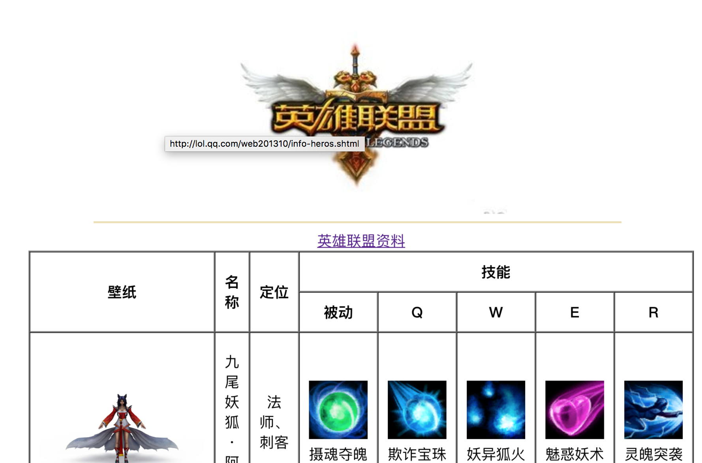
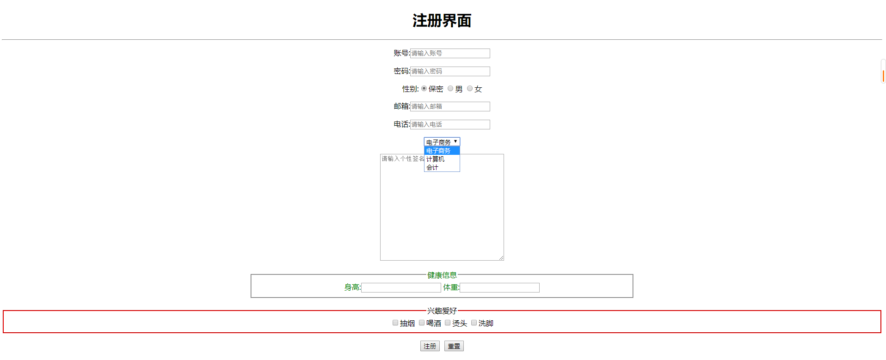

# HTML练习与作业 第三天 

### 练习题目:

1.制作报销申请表

2.制作表格:多重组合表格练习

3.制作表格:注册页面表单

### 作业题目:

1.复习课上代码 回忆表格的制作

2.制作表格'英雄联盟英雄介绍',要求效果如下:

完整效果图地址

[英雄联盟资料.pdf](../../file/html/html03/lolhero.pdf)

图片地址

[magestest.zip](../../file/html/html03/imagestest.zip)

3.制作注册页面,要求效果如下:

其中,'工作性质选择栏'默认选中会计,'健康状况'栏 字体均为绿色,'兴趣爱好'栏仅边框为红色

不要复制黏贴!